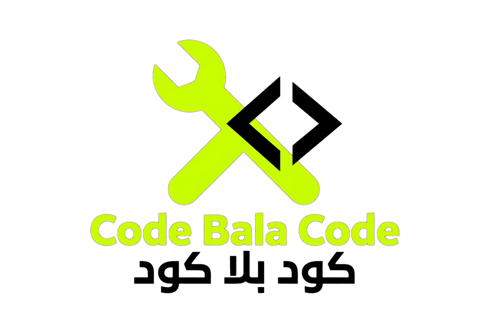

<h1 align="center">كود بلا كود - Code Bala Code</h1>

<b>ارمي الكود.. يشتغل 🔥</b>

⚠️ PROTECTED EDITION - جميع الحقوق محفوظة

  
  

> **تنبيه قانوني:** هذا المشروع محمي بترخيص تجاري. ممنوع البيع او التعديل او الاستخدام التجاري بدون اذن كتابي. GitHub يحفظ تاريخ الرفع كدليل ملكية.

### 🔒 الحماية

- كل ملف يحتوي على بصمة ملكية: `ECB0CAD5FE2AADEB`
- التاريخ الأصلي: 2026-10-08 23:21:40
- الكود الأساسي مشفر جزئيا
- اللوجو والاسم علامة تجارية قيد التسجيل

### 🚀 ازاي تجربه (للأفراد فقط)؟

1. حمل البرنامج
2. شغل `CodeBalaCode.exe`
3. اسحب اي مشروع وارميه

### 💰 عايز تستخدمه تجاريا؟

لو انت:
- مدرسة / سنتر كورسات
- شركة برمجة
- يوتيوبر عايز تشرحه في كورس مدفوع
- عايز تبيعه لطلابك

**لازم ترخيص تجاري.** تواصل: [meahmedm.sayed@gmail.com]

### 📦 المحتويات

- `CodeBalaCode.exe` - البرنامج المحمي (مشفر)
- `projects/` - 5 مشاريع تعليمية (مجانية للتجربة)
- `assets/` - اللوجو والغلاف

### ⚖️ ليه محمي؟

عشان نحافظ على اول نظام مصري من نوعه ونقدر نطوره ونبيعه وندعم المدارس المصرية.

**النسخة المجانية للتجربة فقط - للاستخدام التجاري تواصل معنا.**

Fingerprint: `ECB0CAD5FE2AADEB` - صنع في مصر 2026
